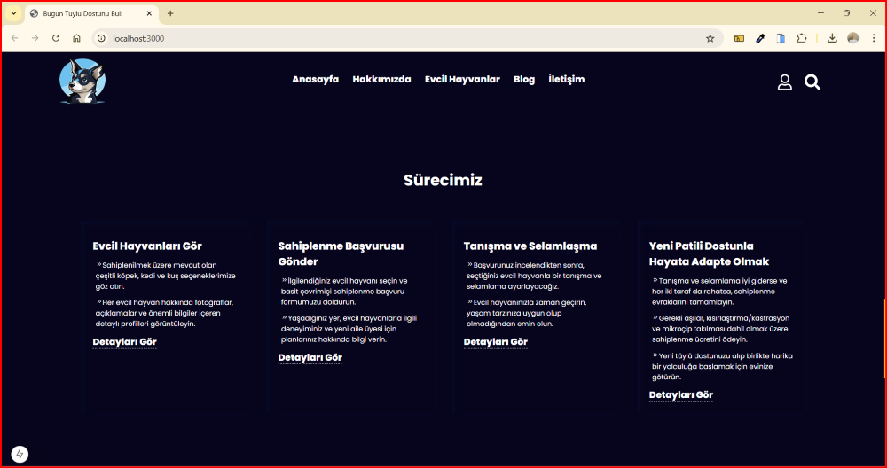

<h1>Evcil Hayvan Sahiplenme Websitesi - NextJs & TypeScript</h1>

Evcil hayvan sahiplenme işlemlerini kolaylaştıran, kullanıcı dostu tasarıma sahip, responsive ve gelişmiş teknolojilerle geliştirdiğim web sitemi tanıtıyorum.

Sayfamızın en üstünde, hayvan sevgisini ve sahiplenme bilincini vurgulayan etkileyici bir sloganımız yer alıyor. Hemen altında, 4 adet özenle seçilmiş, birbirinden sevimli hayvan fotoğrafı sizi karşılıyor. Bu fotoğraflar, sahiplenme çağrımıza dikkat çekerek, sitemizin amacını en iyi şekilde ifade ediyor.

Fotoğrafların altında, sahiplenilmeyi bekleyen tatlı dostlarımızın listesi yer alıyor. Bu liste, hayvanların türüne göre ayrılmış 4 farklı butonla (kedi, köpek, kuş vb.) kolayca filtrelenebiliyor. Hangi butona tıklarsanız, o kategoriye ait hayvanlar listeleniyor.

Her hayvanın üzerine mouse'unuzu getirdiğinizde, cinsiyeti, yaşı, cinsi ve o hayvana ait detaylı bilgiler (sağlık durumu, karakteri vb.) görüntüleniyor. Böylece, aradığınız özelliklere sahip hayvanı kolayca bulabilirsiniz.

Sayfanın aşağısına doğru ilerledikçe, sahiplenme sürecini adım adım anlatan bilgilendirici yazılarla karşılaşıyorsunuz. Bu yazılar, sahiplenme sürecinin nasıl işlediği, nelere dikkat etmeniz gerektiği gibi konularda size rehberlik ediyor.

Daha da aşağıda, 2 adet rastgele seçilmiş hayvanın fotoğrafı ve bilgileri yer alıyor. Bu bölüm, her 5 saniyede bir otomatik olarak yenilenerek, farklı hayvanları keşfetmenizi sağlıyor. Belki de yeni dostunuz burada sizi bekliyordur!

Sayfanın en altında ise, iletişim bilgilerimiz, sosyal medya bağlantılarımız ve diğer önemli bilgilerin yer aldığı footer bölümü bulunuyor.

<h2>Kullanılan Teknolojiler:</h2>

React 19 ve React-DOM 19: React, bileşen bazlı yapısı ile sayfanın her bir bölümünü bağımsız olarak güncellemeyi sağlar.

TypeScript 5: TypeScript statik tip kontrolü sağladığı için hataların erken aşamalarda yakalanmasını sağlar. Ayrıca, daha sürdürülebilir ve ölçeklenebilir bir kod tabanı oluşturur.

Next.js 15.1.6: Sayfa, Next.js framework'u kullanılarak geliştirildi. Next.js, sunucu tarafı render ve statik site üretimi gibi özelliklerle sayfanın performansını artırır. SEO dostu ve hızlı bir deneyim sunar.

ESLint ve ESLint Config Next: Kod kalitesini ve hatalarını kontrol etmek için ESLint yapılandırması kullanılmıştır. Tutarlı kod yazmasıyı sağlar ve olası hataları önceden tespit eder.

React Icons 5.4.0: Etkileşimli öğeler ve simgeler için React Icons kütüphanesini kullanarak modern ve şık ikonlar eklendi.

<h2>GIF</h2>

<h2>Anasayfa</h2>

<h2>Liste</h2>

<h2>Filtreleme</h2>

<h2>Sürecimiz</h2>

<h2>Random Evcil Hayvan Görtüntülenmesi</h2>

